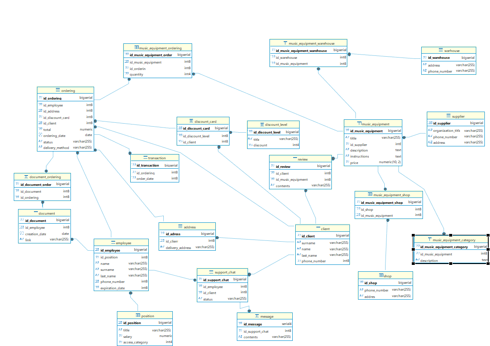
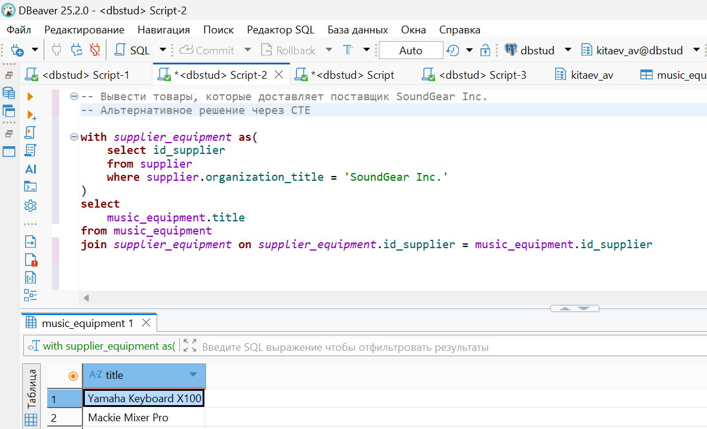
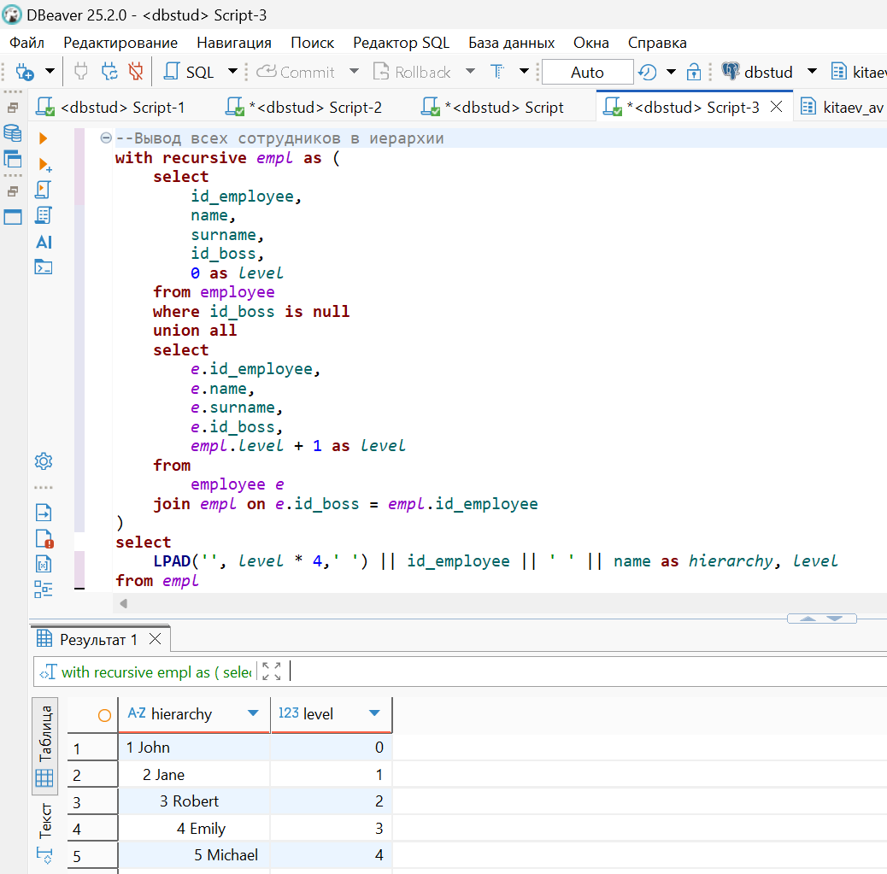
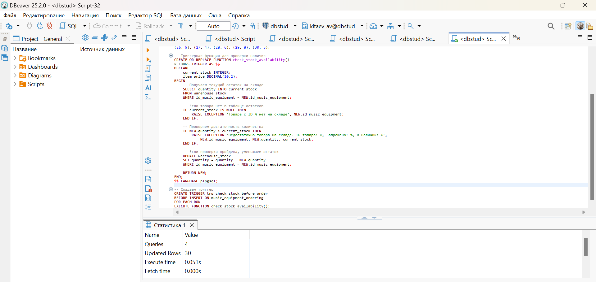
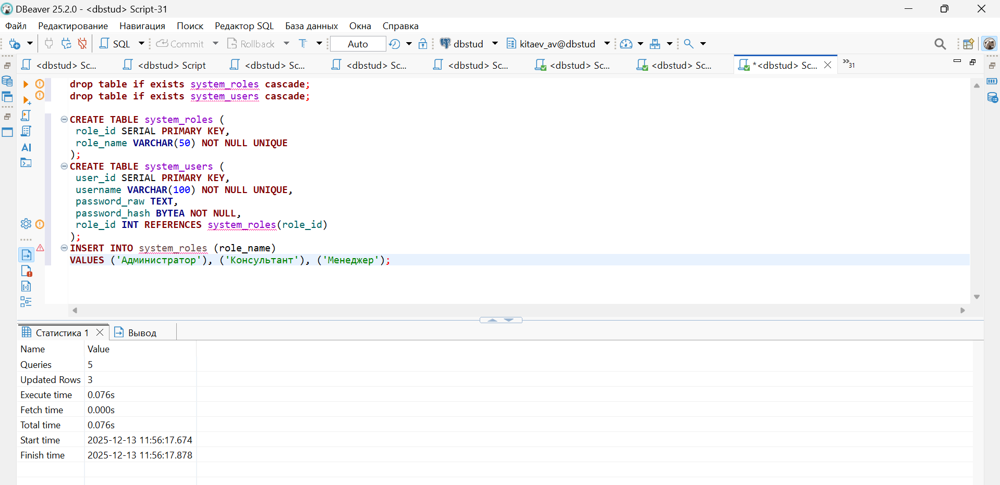
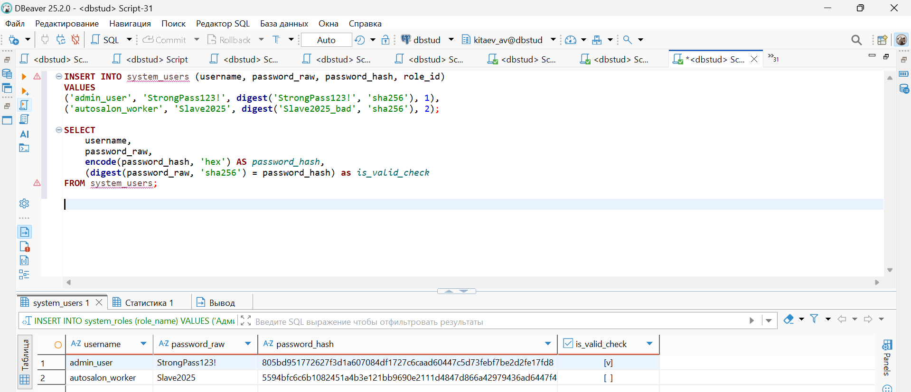
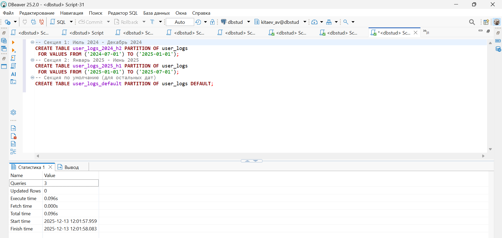

# SQL - портфолио проектов

Привет! Меня зовут **Китаев Алексей**.  
В этом репозитории собраны примеры моих учебных проектов по **SQL** (PostgreSQL) и **проектированию баз данных**.

Здесь показано, что я умею работать с SQL не только на уровне SELECT, но и понимаю устройство БД, умею:
- проектировать структуры данных,
- писать сложные запросы (CTE, подзапросы, агрегаты),
- создавать триггеры и хранимые процедуры,
- оптимизировать запросы (индексы, секционирование),
- работать с безопасностью (хеширование).

---

##  Мои навыки (реальные)

| Навык | Пример из проекта |
| :--- | :--- |
| **Проектирование БД** | Разработал логическую модель для интернет-магазина музыкального оборудования с клиентами, заказами, товарами, поставщиками, складами. Все связи, первичные/внешние ключи проработаны. |
| **Написание SQL-запросов** | Использую `CASE`, подзапросы, `EXISTS`, CTE (рекурсивные в том числе), оконные функции. |
| **Триггеры** | Написал триггер для автоматической подстановки цены и проверки наличия товара при создании заказа. |
| **Хранимые процедуры и функции** | Создавал функции и процедуры на PL/pgSQL для автоматизации рутинных задач. |
| **Секционирование** | Разбил таблицу логов на партиции по диапазонам дат (RANGE) для ускорения запросов. |
| **Индексы** | Создавал индексы для часто фильтруемых полей. |
| **Безопасность** | Хранил хеши паролей (SHA-256) в поле типа `BYTEA`, реализовал проверку введённого пароля. |
| **Инструменты** | PostgreSQL, DBeaver, ChartDB, Git |

---

##  Примеры работ (с иллюстрациями)

### 1. Проектирование структуры БД
Я разработал схему для системы продаж. На диаграмме ниже видны основные таблицы, их атрибуты и связи (один-ко-многим, многие-ко-многим). Это демонстрирует понимание нормализации и архитектуры данных.

---

### 2. Сложные запросы
Пример запроса с обобщённым табличным выражением (CTE) для расчёта аналитики по заказам. Использовал агрегацию и группировку.

---

---

### 3. Триггер для контроля корректности данных
Реализовал триггер, который при вставке нового заказа автоматически подставляет цену товара из таблицы оборудования и проверяет, есть ли нужное количество на складе. Если нет - операция отклоняется.

---

### 4. Безопасность (хеширование паролей)
В таблице пользователей предусмотрел поля для хранения сырого пароля (учебный пример) и его хеша (тип BYTEA). Хеш вычислял через функцию `digest()` (SHA-256). Также показал проверку соответствия пароля хешу - одна успешная, одна неуспешная.

---

---

### 5. Оптимизация запросов (секционирование)
Для таблицы логов событий создал секции по диапазонам дат (RANGE) - второе полугодие 2024, первое полугодие 2025 и секцию по умолчанию. Это ускорило выборки за конкретный период.

---

## 📜 Дополнительное обучение

Я прошёл курс по основам SQL и базам данных, чтобы углубить свои знания. Сертификат подтверждает изучение тем: написание запросов, проектирование структур, работа с PostgreSQL.

> 📄 **Сертификат** – файл `sql.pdf` (доступен для просмотра и скачивания).

---

## 🛠️ Технологии

- PostgreSQL, PL/pgSQL
- DBeaver
- Git, GitHub

